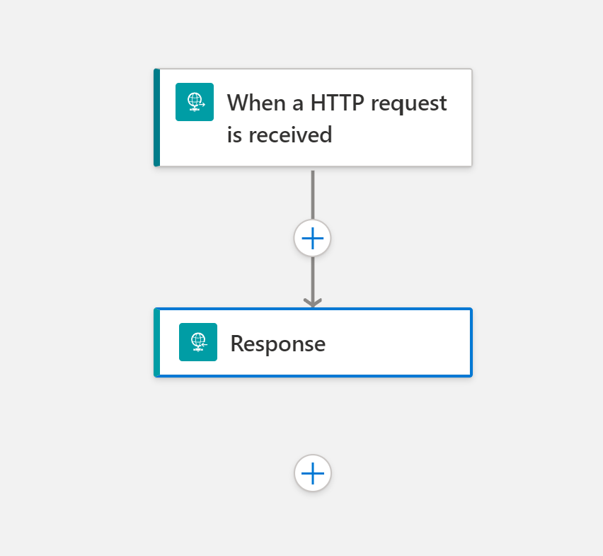

# ais-sync-pattern-la-std-vnet

Deploy a Logic App synchronous pattern VNET isolated in a App Service Environment exposed via Front Door and API Management. This deployment can be done by Github Actions or manually.

To setup API Management with Azure Front Door, I used this [deployment script](https://github.com/Azure/azure-quickstart-templates/tree/master/quickstarts/microsoft.network/front-door-api-management).

I also used [this blog](https://techcommunity.microsoft.com/t5/azure-paas-blog/integrate-azure-front-door-with-azure-api-management/ba-p/2654925) to get more insights on the process.

To also enable a Web Application Firewall (WAF) in Front Door, I used [this](https://docs.microsoft.com/en-us/azure/web-application-firewall/afds/waf-front-door-create-portal) guide.

In my journey I ran into some networking related issue's. When you are deploying APIM in external mode, everything routes through the VNET. So, this means you still have to open some ports in the Network Security Groups attached to the APIM Subnet, in order to get API Management running appropiattely. Here is a [link](https://docs.microsoft.com/en-us/azure/api-management/api-management-using-with-vnet?tabs=stv2#control-plane-ip-addresses) which tells you which ports to open.

For deployment I choose to do it all in Bicep templates. I haven't done a lot with Bicep yet, so it's about time I do. I got most of my examples from [here](https://github.com/Azure/bicep/tree/main/docs/examples).

For deploying the Logic App (Standard) via [Github Actions](https://github.com/Azure/logicapps/tree/master/github-sample).
For deploying the Logic App (Standard) via [Azure DevOps](https://github.com/Azure/logicapps/tree/master/azure-devops-sample).

## Architecture


## Prerequisites

* Install [Visual Studio Code](https://code.visualstudio.com/download)
* Install [Azure Logic Apps (Standard)](https://marketplace.visualstudio.com/items?itemName=ms-azuretools.vscode-azurelogicapps) Extension for Visual Studio Code.
* Install [Azurite](https://marketplace.visualstudio.com/items?itemName=Azurite.azurite) Extension for Visual Studio Code.
* Install [REST Client](https://marketplace.visualstudio.com/items?itemName=humao.rest-client) Extension for Visual Studio Code.
* Install Chocolatey (package manager)

```ps1
Set-ExecutionPolicy Bypass -Scope Process -Force; [System.Net.ServicePointManager]::SecurityProtocol = [System.Net.ServicePointManager]::SecurityProtocol -bor 3072; iex ((New-Object System.Net.WebClient).DownloadString('https://community.chocolatey.org/install.ps1'))
```

* Install Azure Function Core Tools (x64 is needed for debugging)

```ps1
choco install azure-functions-core-tools-3 --params "'/x64'"
```

* Install .NET Core SDK

```ps1
choco install dotnetcore-sdk --params "'/x64'"
```

* Install Bicep CLI

```ps1
choco install bicep
```

* Install Az Module in PowerShell

```ps1
Install-Module -Name Az -AllowClobber -Scope CurrentUser
```

* Install Logic App Azure Cli extensions

```ps1
az extension add --name logic
az extension add --yes --source "https://aka.ms/logicapp-latest-py2.py3-none-any.whl"
```

## Deploy Manually

* Git Clone the repository

```ps1
git clone https://github.com/pascalvanderheiden/ais-sync-pattern-la-std-vnet.git
```

* Create a Logic App Standard locally
Now everything is setup & ready to create your first workflow. In order to follow an agile development process I use [Visual Studio Code to create my Logic Apps (Standard)](https://docs.microsoft.com/en-us/azure/logic-apps/create-single-tenant-workflows-visual-studio-code) and I use Github to sync, share, deploy & collaborate my code.

I've already prepared a simpel request and response workflow in this repository. Which we can deploy via Visual Studio Code or the Az Cli.



* Deploy it all by one script
I've included all the steps in 1 Powershell script. This will create all the needed resources, and will deploy the Logic App and the API in API Management. Keep in mind that this will take a while to deploy.

Due to lazyness I've used variables:

```ps1
$subscriptionId = "<subscription_id>"
$deploymentNameBuild = "<deployment_name_build>"
$deploymentNameRelease = "<deployment_name_release>"
$namePrefix = "<project_prefix>"
$workflowName = "<workflow_name>"
$apiName = "<api_name>"
$apiPath = "<api_path>"
# For removing soft-delete
$apimName = "<apim_name>"
```

```ps1
.\deploy\manual-deploy.ps1 -subscriptionId $subscriptionId -deploymentNameBuild $deploymentNameBuild -deploymentNameRelease $deploymentNameRelease -namePrefix $namePrefix -workflowName $workflowName -apiName $apiName -apiPath $apiPath
```

* Remove the APIM Soft-delete
If you deleted the deployment via the Azure Portal, and you want to run this deployment again, you might run into the issue that the APIM name is still reserved because of the soft-delete feature. You can remove the soft-delete by using this script:

```ps1
.\deploy\del-soft-delete-apim.ps1 -subscriptionId $subscriptionId -apimName $apimName
```

* Testing
I've included a tests.http file with relevant Test you can perform, to check if your deployment is successful.

## Deploy via Github Actions

* Generate a Service Principal

```ps1
az ad sp create-for-rbac -n <name_sp> 
```

Copy the json output of this command.

* Update GitHub Secrets for customizing your deployment
In the repository go to 'Settings', on the left 'Secrets', 'Actions'.
And past the json output in the command used above into the secret 'AZURE_CREDENTIALS'.
Also update the secret 'AZURE_SUBSCRIPTION_ID' with the subscription id from Azure, 'LOCATION' with a valid Azure Region, like 'West Europe' and 'DEPLOYMENT_NAME_BUILD' with a name for your deployment. For naming convention on this deployement, you only need to fill 'PREFIX' with a suitable prefix, so al resources that are created have a readable reference in the name.

* Commit, and it will trigger your workflow.
