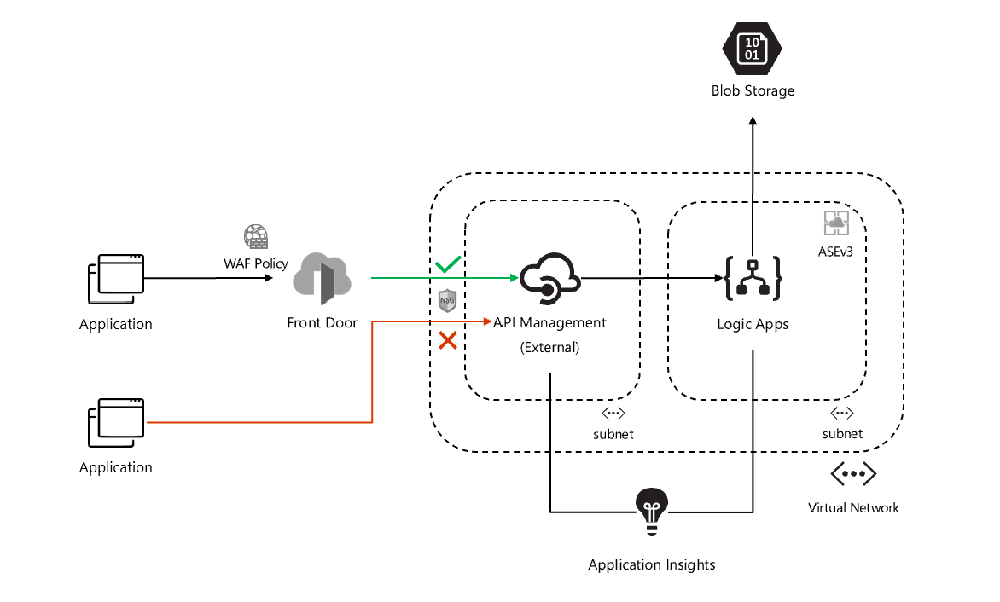

# ais-sync-pattern-la-std-vnet

Deploy a Logic App synchronous pattern VNET isolated in a App Service Environment exposed via Front Door and API Management. This deployment can be done by Github Actions or Azure DevOps.

To setup API Management with Azure Front Door, I used this [deployment script](https://github.com/Azure/azure-quickstart-templates/tree/master/quickstarts/microsoft.network/front-door-api-management).

I also used [this blog](https://techcommunity.microsoft.com/t5/azure-paas-blog/integrate-azure-front-door-with-azure-api-management/ba-p/2654925) to get more insights on the process.

To also enable a Web Application Firewall (WAF) in Front Door, I used [this](https://docs.microsoft.com/en-us/azure/web-application-firewall/afds/waf-front-door-create-portal) guide.

In my journey I ran into some networking related issue's. When you are deploying APIM in external mode, everything routes through the VNET. So, this means you still have to open some ports in the Network Security Groups attached to the APIM Subnet, in order to get API Management running appropiattely. Here is a [link](https://docs.microsoft.com/en-us/azure/api-management/api-management-using-with-vnet?tabs=stv2#control-plane-ip-addresses) which tells you which ports to open.

For deployment I choose to do it all in Bicep templates. I haven't done a lot with Bicep yet, so it's about time I do. I got most of my examples from [here](https://github.com/Azure/bicep/tree/main/docs/examples).

For deploying the Logic App (Standard) via [Github Actions](https://github.com/Azure/logicapps/tree/master/github-sample).
For deploying the Logic App (Standard) via [Azure DevOps](https://github.com/Azure/logicapps/tree/master/azure-devops-sample).

## Architecture



## Prerequisites

* Install [Visual Studio Code](https://code.visualstudio.com/download)
* Install [Azure Logic Apps (Standard)](https://marketplace.visualstudio.com/items?itemName=ms-azuretools.vscode-azurelogicapps) Extension for Visual Studio Code.
* Install [Azurite](https://marketplace.visualstudio.com/items?itemName=Azurite.azurite) Extension for Visual Studio Code.
* Install [REST Client](https://marketplace.visualstudio.com/items?itemName=humao.rest-client) Extension for Visual Studio Code.
* Install Chocolatey (package manager)

```ps1
Set-ExecutionPolicy Bypass -Scope Process -Force; [System.Net.ServicePointManager]::SecurityProtocol = [System.Net.ServicePointManager]::SecurityProtocol -bor 3072; iex ((New-Object System.Net.WebClient).DownloadString('https://community.chocolatey.org/install.ps1'))
```

* Install Azure Function Core Tools (x64 is needed for debugging)

```ps1
choco install azure-functions-core-tools-3 --params "'/x64'"
```

* Install .NET Core SDK

```ps1
choco install dotnetcore-sdk --params "'/x64'"
```

* Install Bicep CLI

```ps1
choco install bicep
```

* Install Az Module in PowerShell

```ps1
Install-Module -Name Az -AllowClobber -Scope CurrentUser
```

* Install Logic App Azure Cli extensions

```ps1
az extension add --name logic
az extension add --yes --source "https://aka.ms/logicapp-latest-py2.py3-none-any.whl"
```

## Deploy Manually step by step

* Git Clone the repository

```ps1
git clone https://github.com/pascalvanderheiden/ais-sync-pattern-la-std-vnet.git
```

* Defining some variables we need

```ps1
$subscriptionId = "xxxx-xxxx-xxxx-xxxx"
$deploymentNameBuild = "<deployment_name_build>"
$deploymentNameRelease = "<deployment_name_release>"
$namePrefix = "<project_prefix>"
$location = "West Europe"
$resourceGroup = "$namePrefix-rg"
$apiName = "<api_name>"
$apiPath = "<api_path>"
$workflowName = "<workflow_name>"
$buildBicepPath = ".\deploy\build\main.bicep"
$releaseBicepPath = ".\deploy\release\$workflowName-deploy-api.bicep"
$logicAppName = "$namePrefix-la"
$workflowPath = ".\$workflowName"
$destinationPath = ".\deploy\release\$workflowName-deploy.zip"
$apimNameValueSig = "$workflowName-sig"
```

* Connect with Azure and set the Subscription to deploy resources to.

```ps1
Connect-AzAccount
Set-AzContext -Subscription $subscriptionId
```

* Deploy Azure services (refer to the location of the main.bicep file)

```ps1
New-AzSubscriptionDeployment -name $deploymentNameBuild -namePrefix $namePrefix -Location $location -TemplateFile $buildBicepPath -AsJob
```

* Check on the status of the deployment

```ps1
Get-AzSubscriptionDeployment -Name $deploymentNameBuild
```

* Retrieve API Management Name (generated in script)

```ps1
$apimName = az apim list --resource-group $resourceGroup --subscription $subscriptionId --query "[].{Name:name}" -o tsv
Write-Host $apimName
```

* Get Storage Account Name & Key for Logic App Deployment

```ps1
$storageAccountName = az storage account list -g $resourceGroup --subscription $subscriptionId --query "[].{Name:name}" -o tsv
$storageKey = az storage account keys list -g $resourceGroup -n $storageAccountName --query "[0].{Name:value}" -o tsv
Write-Host $storageAccountName
```

* Create and deploy your local developed Logic App to Azure
Now everything is setup & ready to create your first workflow. In order to follow an agile development process I use [Visual Studio Code to create my Logic Apps (Standard)](https://docs.microsoft.com/en-us/azure/logic-apps/create-single-tenant-workflows-visual-studio-code) and I use Github to sync, share, deploy & collaborate my code.

I've already prepared a simpel request and response workflow in this repository. Which we can deploy via Visual Studio Code or the Az Cli.


Because I prepared this solution already for a DevOps approach, I will use the CLI.

Logic Apps Standard uses Azure Storage for storing the workflows. So, we only need to copy these files to the File Share in my Storage Account. My Storage Account is public in my case, but you can also make this private as well, and use Service Endpoints to create a isolated connection between Logic Apps and Azure Storage.

```ps1
az storage file upload --account-name $storageAccountName --account-key $storageKey --share-name $logicAppName --path "site/wwwroot/host.json" --source ".\host.json"
#az storage file upload --account-name $storageAccountName --account-key $storageKey --share-name $logicAppName --path "site/wwwroot/connections.json" --source ".\connections.json"
az storage directory create --account-name $storageAccountName --account-key $storageKey --name "site/wwwroot/$workflowName" --share-name $logicAppName
az storage file upload --account-name $storageAccountName --account-key $storageKey --share-name $logicAppName --path "site/wwwroot/$workflowName/workflow.json" --source ".\$workflowName\workflow.json"
```

* Store the SAS signature in a Named Value in API Management
We need to store the SAS signature, so we can use this in the API definition in API Management. I've created a PowerShell script to retrieve the signature, and place it into a Named Value in API Management.

```ps1
.\deploy\release\get-saskey-from-logic-app.ps1 -subscriptionId $subscriptionId -resourceGroup $resourceGroup -logicAppName $logicAppName -workflowName $workflowName -apimName $apimName -apimNamedValueSig $apimNameValueSig
```

* Deploy the API to API Management (refer to the location of the apim-ais-sync-get-wf-deploy.bicep file)

```ps1
New-AzResourceGroupDeployment -Name $deploymentNameRelease -ResourceGroupName $resourceGroup -apimName $apimName -logicAppName $logicAppName -workflowName $workflowName -workflowSigNamedValue $apimNameValueSig -apiName $apiName -apiPath $apiPath -TemplateFile $releaseBicepPath -AsJob
```

* Just do it by script
If you don't want to execute each single step; I've included all the steps in 1 Powershell script:

```ps1
.\deploy\manual-deploy.ps1 -subscriptionId "xxxx-xxxx-xxxx-xxxx" -deploymentNameBuild "<deployment_name_build>" -deploymentNameRelease "<deployment_name_release>" -namePrefix "<project_prefix>" -workflowName "<workflow_name>" -apiName "<api_name>" -apiPath "<api_path>"
```

* Testing
I've included a tests.http file with relevant Test you can perform, to check if your deployment is successful.

## Deploy via Github Actions

## Deploy via Azure DevOps
